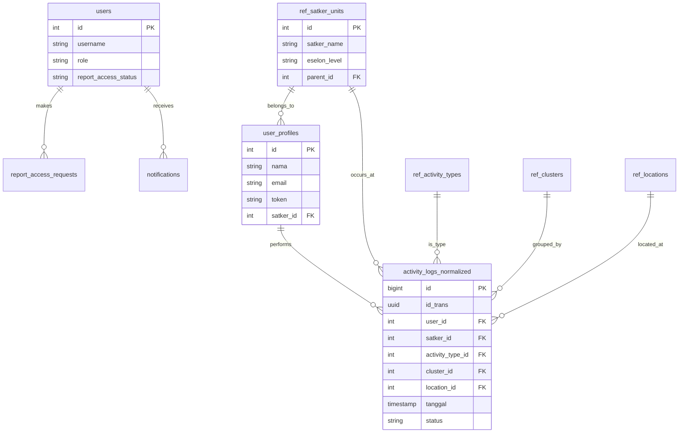

# Database Schema Documentation

This document describes the current database schema for the BPK Dashboard application. The database has been normalized to improve data integrity and query performance.

## Overview

The database `daring_bpk` consists of the following key components:
1. **Reference Tables**: Lookup tables for standardized data (clusters, activity types, locations, satker units).
2. **User Management**: Tables for system authentication and user profiles.
3. **Activity Logs**: The core table storing user activity data, normalized with foreign keys.
4. **Access Control**: Tables for managing report access requests and notifications.

## Entity Relationship Diagram (ERD)



## Table Definitions

### 1. Reference Tables

#### `ref_clusters`
Groups activities into high-level clusters.
- `id`: Serial PK
- `name`: Cluster name (Unique)
- `description`: Optional description

#### `ref_activity_types`
Defines types of activities users can perform.
- `id`: Serial PK
- `name`: Activity name (Unique)
- `category`: Broad category (e.g., "Monitoring & View", "System Auth")
- `description`: Optional description

#### `ref_locations`
Stores location data derived from activity logs.
- `id`: Serial PK
- `location_name`: Name of the location (Unique)
- `province`: Province name
- `location_type`: Type of location

#### `ref_satker_units`
Hierarchical structure of organizational units (Satuan Kerja).
- `id`: Serial PK
- `satker_name`: Unit name (Unique)
- `eselon_level`: Eselon level (e.g., E1, E2)
- `parent_id`: Self-referencing FK for hierarchy

### 2. User Management

#### `users`
System accounts for dashboard access (Admins/Viewers).
- `id`: Serial PK
- `username`: Login username
- `password_hash`: Bcrypt hash
- `role`: 'admin' or 'user'
- `report_access_status`: 'none', 'pending', 'approved', 'rejected'

#### `user_profiles`
Profiles of users whose activities are being monitored (from imported logs).
- `id`: Serial PK
- `nama`: User's full name
- `email`: Email address
- `token`: User token identifier
- `satker_id`: FK to `ref_satker_units`

### 3. Activity Data

#### `activity_logs_normalized`
Central table for all activity records.
- `id`: BigSerial PK
- `id_trans`: UUID from source system (Unique)
- `user_id`: FK to `user_profiles`
- `satker_id`: FK to `ref_satker_units`
- `activity_type_id`: FK to `ref_activity_types`
- `cluster_id`: FK to `ref_clusters`
- `location_id`: FK to `ref_locations`
- `scope`: Activity scope
- `detail_aktifitas`: Detailed description
- `status`: 'SUCCESS' or 'FAILED'
- `tanggal`: Timestamp of activity

### 4. Access Control & Notifications

#### `report_access_requests`
Tracks user requests to access restricted reports.
- `id`: Serial PK
- `user_id`: FK to `users`
- `status`: Request status
- `reason`: User's reason for access

#### `notifications`
System notifications for users.
- `id`: Serial PK
- `user_id`: FK to `users`
- `message`: Notification content
- `is_read`: Read status

## Migration Guide

To migrate the database schema:

1. **Run Migrations**:
   ```powershell
   cd backend
   go run cmd/migrate/main.go
   ```

2. **Import Data**:
   Use the import tool to load CSV data into the normalized schema.
   ```powershell
   cd backend
   go run cmd/import/main.go path/to/data.csv
   ```
